## 🧠 EduAgent — AI Assistant for Schools on Solana

<p align="center">
  
</p>

<p align="center">
  
  
  
</p>

🏆 Built for **Solana Cypherpunk Hackathon 2025**  
🇰🇿 Powered by **AImpact × Superteam KZ**

---

## 🌍 Overview

**EduAgent** is an AI assistant and blockchain payment layer for language schools in Kazakhstan.  
Built on **Solana blockchain**, integrated with **KZTE (Digital Tenge)** and **USDC** for transparent tuition payments and AI-assisted communication.

It enables:  
- seamless tuition payments via stablecoins  
- AI-driven parent notifications through **Telegram and WhatsApp**  
- NFT-based student achievements for gamified motivation

> “EduAgent turns education into a Web3 experience — where every lesson, payment, and achievement lives on-chain.”

---

## 🧩 Current Focus

EduAgent is preparing a **real-world pilot** with **three operating English language centers** in Kazakhstan (~300 active students).  
These schools are ready to test a blockchain-based tuition and notification system using Solana stablecoins integrated with AI-powered messaging.

The pilot will demonstrate:  
- automated tuition payments using KZTE / USDC  
- instant blockchain-verified receipts  
- NFT-based student badges for attendance and performance tracking

This serves as a **proof of concept** for combining fintech and education in Central Asia — bridging schools, parents, and blockchain rails.

---

## 🧠 Why It Matters

Traditional schools still rely on manual cash handling and paper records.  
EduAgent replaces that with an automated Web3 solution that:

- lets parents pay tuition in stablecoins (KZTE, USDC)  
- verifies each transaction instantly on Solana  
- rewards students with NFT badges  
- connects parents via AI-powered chat in Telegram and WhatsApp

---

## 🧩 Architecture

```
[Frontend]  Web / Telegram / WhatsApp
       │
       │ HTTPS / WebSocket / Webhook (Wazzup API)
       ▼
[Backend]  FastAPI / Gemini AI / HoliHop CRM
       │
       │ JSON-RPC calls
       ▼
[Solana Layer]  Mainnet (payment & NFT contracts)
```

---

### FRONTEND — Interfaces

1. **Telegram Bot** (`telebot` / `aiogram`)  
   Commands `/pay`, `/balance`, `/ask` → backend REST API.

2. **WhatsApp Bot** (via **Wazzup API**)  
   Same flow as Telegram, using webhooks `/webhook/wazzup`, `/api/pay`, `/api/ai`.  
   Message examples:  
   - “Your payment is confirmed ✅ Receipt on Solana” 
   - “Reminder: next class starts at 10:30.” 

3. **Web Dashboard**  
   For administrators: HTML/JS interface showing students, tuition, and blockchain receipts.

---

### BACKEND — Core Logic Layer

| Module | Description |
|--------|-------------|
| **Payment Engine** | Handles tuition transactions, Solana RPC calls, and logs data to Supabase. |
| **AI Engine** | Gemini 1.5 Flash — generates multilingual replies and smart reminders. |
| **Messaging Dispatcher** | Routes outbound messages to Telegram and WhatsApp (Wazzup). |
| **CRM Connector** | Integrates HoliHop CRM for attendance and tuition tracking. |

Example FastAPI routes:
```python
@app.post("/api/pay")
def create_payment(payload: PaymentSchema):
    tx = solana_client.transfer(payload)
    return {"status": "success", "tx_hash": tx}

@app.post("/api/ai")
def ask_ai(question: Question):
    return {"reply": gemini.generate(question.text)}
```

---

### SOLANA LAYER — Blockchain Operations

Real transactions run on **Solana Mainnet**.  
Devnet is used only for safe local testing.

| Component | Address | Function |
|------------|----------|-----------|
| School Treasury Wallet | `9kR8ZZ9D3RQkWkY8Z1MpvBxTSD7SMF85i4iDqEfeQ6Ef` | Receives tuition |
| KZTE Stablecoin | `4R4Ve5xHaHzZLJxKcL5UZFXEhCFgC7yUv3xHpoZSnQfL` | Digital Tenge |
| NFT Badge Mint | `B71mZqYRi6gqH4mGafSkaoGbTtVfB2ELbKq9bPKRrj6t` | Student achievements |

---

### Communication Flow (Telegram + WhatsApp)

```mermaid
sequenceDiagram
  participant Parent
  participant Channel (Telegram/WhatsApp)
  participant Backend
  participant Solana
  participant Supabase

  Parent->>Channel: /pay 120 KZTE
  Channel->>Backend: Webhook (telebot / Wazzup)
  Backend->>Solana: send transaction()
  Solana-->>Backend: tx_hash (confirmed)
  Backend->>Supabase: log (payment)
  Backend-->>Channel: ✅ Tuition verified on Solana
```



---

### AI Message Flow

```mermaid
sequenceDiagram
  Parent->>WhatsApp: "When is next class?"
  WhatsApp->>Backend: webhook → /api/ai
  Backend->>GeminiAI: generate(text_prompt)
  GeminiAI-->>Backend: {"reply":"Next class at 10:30 AM"}
  Backend-->>WhatsApp: sendMessage(reply)
```



---

## 🧰 Tech Stack

| Layer | Technology |
|-------|-------------|
| Frontend | HTML, JavaScript, Telegram Bot, Wazzup API (WhatsApp) |
| Backend | FastAPI, Flask, Supabase, HoliHop CRM |
| Blockchain | Solana Mainnet (solpy, Web3.js) |
| AI | Google Gemini 1.5 Flash |
| Payments | KZTE / USDC via Intebix Rails |
| NFTs | Metaplex |
| Hosting | Railway + Vercel |

---

## ☁️ Deployment

**Dev / test mode (safe local debugging):**
```bash
RPC_URL=https://api.devnet.solana.com
```

**Production (real payments):**
```bash
RPC_URL=https://api.mainnet-beta.solana.com
```

---

## 🗺️ Roadmap

| Quarter | Milestone | Status |
|----------|------------|---------|
| Q4 2025 | Pilot setup (3 schools + AI messaging) | ✅ |
| Q1 2026 | NFT reward system via Metaplex | 🔄 |
| Q2 2026 | Full stablecoin payments on Mainnet | 🧩 |
| Q3 2026 | Multi-school pilot rollout | ⏳ |
| Q4 2026 | Nationwide EduAgent deployment | 🌍 |

---

## 👥 Team

| Member | Role | Location |
|---------|------|-----------|
| **Rakhman Ibragimov** | Founder & Developer | Astana, Kazakhstan |

Community Partners: **Superteam KZ × Solana Builders**

---

## 📜 License

MIT License © 2025 Rakhman Ibragimov  
Built with 💜 on **Solana** — where AI meets Education.

<p align="center">
  
</p>
